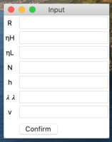
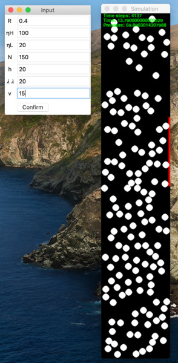
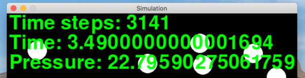

# ideal\_gas\_simulator
A program simulating behaviour of ideal gas particles.

## Table of Contents
* [Usage - Simulation](#usage-simulation)
* [Usage - Testing](#usage-testing)
* [High performance - pypy3](#usage-pypy3)

## Usage - Simulation
Launch ```simulation.py``` file. An window asking for input data will appear:



Fill the fields and click ```Confirm```. After a couple of seconds a simulation window should appear:



At the top, you can see three readings, updated live:



They stand for Time steps (number of iterations), Time passed (total approximate time elapsed in the simulation) and Pressure measured so far.

Have fun watching all the impacts!

## Usage - Testing
For multiple tests, use an alternative file ```test_app.py```. It is focused on high - performance and thus does not use any GUI. In command line you'll be asked for three inputs:

* Maximum starting velocity
* The value of (N / h)
* Depending on what you've chosen - Detector's heighth or number of atoms

Click ```enter``` and get the results! If you've chosen ```N``` as your variable, then you'll be presented 50 pairs of numbers standing for number of atoms in simulation (from 10 to 500, with a simulation step of 10) and measured pressure.

If you have chosen ```h``` as your variable, then you will be presented 41 pairs of numbers, standing for detector's level (from 0 to 40, with step of 1) and measured pressure.

## Usage - pypy3
Even using the ```test_app.py```, the Python3 performance is limited. Some launches can take up to 50 minutes! Instead, I recommend using pypy3 (```brew install pypy3```). It's much faster than standard CPython (even the longest simulations will take up to 5 minutes), but has its own limits. There is a compatibility problem with pygame module, but fortunately - it's easy to solve. Go to ```./utils/gui.py``` and ```./utils/elements.py``` and comment out the second line:

```
# import pygame
```
Then type ```pypy3 test_app.py``` and enjoy your high-performance tests. Do not forget to uncomment when you want to use ```simulation.py``` because it wont't work!

